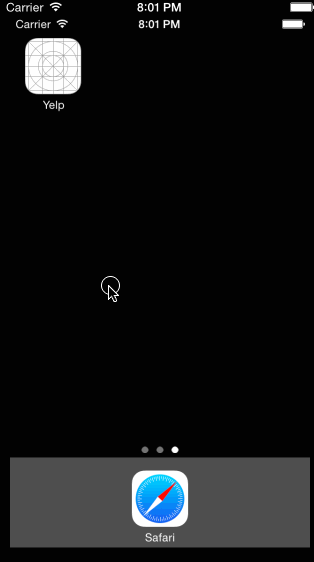

Yelp Client
========

Time spent: 8 hours.

## Walkthrough

GIF created with [LiceCap](http://www.cockos.com/licecap/).

## Implemented Stories
#### Required - all
* Search results page
  * Table rows should be dynamic height according to the content height
  * Custom cells should have the proper Auto Layout constraints
  * Search bar should be in the navigation bar
* Filter page
  * The filters you should actually have are: category, sort (best match, distance, highest rated), radius (meters), deals (on/off).
  * The filters table should be organized into sections as in the mock.
  * You can use the default UISwitch for on/off states.
  * Radius filter should expand as in the real Yelp app.
  * Categories should show a subset of the full list with a "See All" row to expand.
  * Clicking on the "Search" button should dismiss the filters page and trigger the search w/ the new filter settings.

#### Optional

## References

Codepath, http://courses.codepath.com/courses/intro_to_ios/week/2#!assignment
